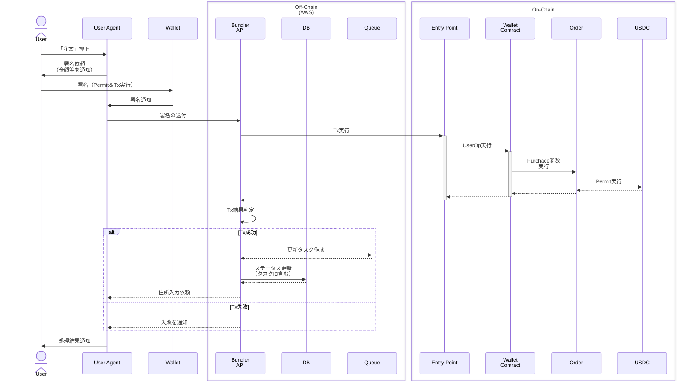
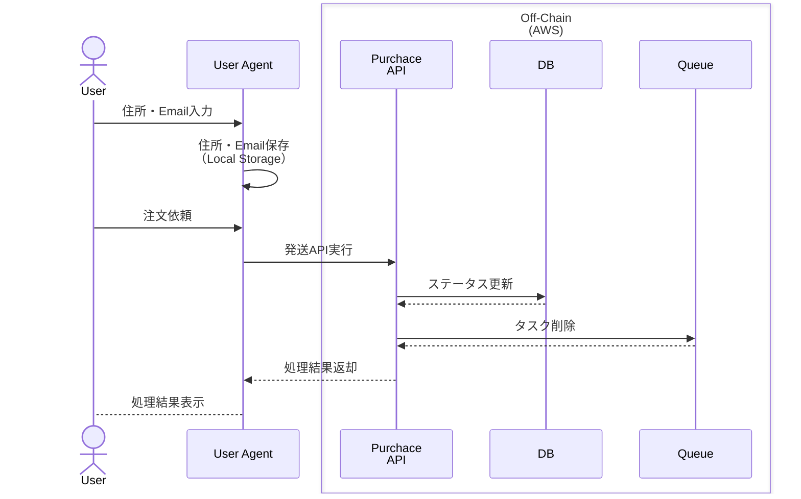

# 処理フロー

## 入金処理

```mermaid
sequenceDiagram
    actor User
    participant UA as User Agent
    participant Wallet
    
    box Off-Chain<br/>(AWS)
        participant Bundler as Bundler<br/>API
        participant DB
        participant Queue
    end
    box On-Chain
        participant Entry Point
        participant WalletC as Wallet<br/>Contract
        participant Order
        Participant USDC
    end

    User ->> UA: 「注文」押下
    UA ->> User: 署名依頼<br/>（金額等を通知）
    User ->> Wallet: 署名（Permit＆Tx実行）
    Wallet ->> UA: 署名通知
    UA ->> Bundler: 署名の送付

    Bundler ->>+ Entry Point: Tx実行
    Entry Point ->>+ WalletC: UserOp実行
    WalletC ->> Order: Purchace関数<br>実行
    Order ->> USDC: Permit実行
    USDC -->> Order: 
    Order -->> WalletC: 
    WalletC -->>- Entry Point: 
    Entry Point -->>- Bundler: 

    Bundler ->> Bundler: Tx結果判定
    alt Tx成功 
        Bundler ->> Queue: 更新タスク作成
        Queue -->> Bundler: 
        Bundler ->> DB: ステータス更新<br/>（タスクID含む）
        DB -->> Bundler: 
        Bundler -->> UA: 住所入力依頼
    else Tx失敗
        Bundler -->> UA: 失敗を通知
    end
    UA ->> User: 処理結果通知
```

## 発送依頼（注文確定）

```mermaid
sequenceDiagram
    actor User
    participant UA as User Agent
    box Off-Chain<br/>(AWS)
        participant API as Purchace<br/>API
        participant DB
        participant Queue
    end
    
    User ->> UA: 住所・Email入力
    UA ->> UA: 住所・Email保存<br/>（Local Storage）
    User ->> UA: 注文依頼
    UA ->> API: 発送API実行
    API ->> DB: ステータス更新
    DB -->> API:  
    API ->> Queue: タスク削除
    Queue -->> API:  
    API -->> UA: 処理結果返却
    UA --> User: 処理結果表示
```